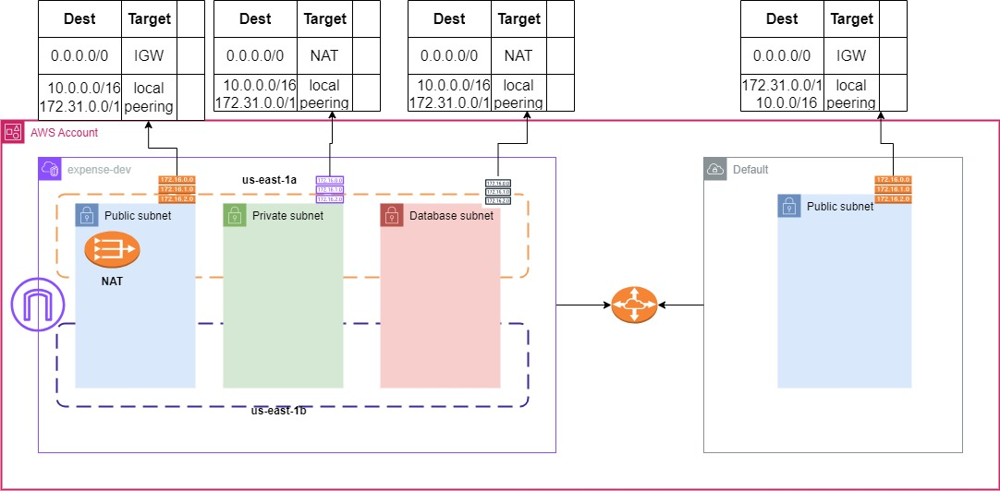

# Terraform AWS VPC Module Customised

This module is going to create the following resources. for HA we are going to get first 2 AZ.

* VPC
* Internet Gateway associated with VPC
* 2 Public Subnets
* 2 Private Subnets
* 2 Database Subnets
* Database subnet group
* EIP
* NAT Gateway
* Public Route table
* Private Route table
* Database Route table
* Routes
* Route table associations with subnets
* Peering with default VPC(if Required)
* Peering routes in acceptor and requestor route tables

# Inputs
* project_name (Mandatory): User must supply their project name.
* environment (Mandatory): User must supply their environment name.
* vpc_cidr (Mandatory): User must supply their VPC CIDR.
* enable_dns_hostnames (Optional): defaults to true.
* common_tags (Optional): Default is empty. User can supply tags in map(string) format.
* vpc_tags (Optional): Default is empty. User can supply tags in map(string) format.
* igw_tags (Optional): Default is empty. User can supply tags in map(string) format.
* public_subnet_cidrs (Mandatory): User must supply only 2 valid public subnet CIDR.
* public_subnet_tags (Optional): Default is empty. User can supply tags in map(string) format.
* private_subnet_cidrs (Mandatory): User must supply only 2 valid private subnet CIDR.
* private_subnet_tags (Optional): Default is empty. User can supply tags in map(string) format.
* database_subnet_cidrs (Mandatory): User must supply only 2 valid database subnet CIDR.
* database_subnet_tags (Optional): Default is empty. User can supply tags in map(string) format.
* db_subnet_group_tags (Optional): Default is empty. User can supply tags in map(string) format.
* nat_gateway_tags (Optional): Default is empty. User can supply tags in map(string) format.
* public_route_table_tags (Optional): Default is empty. User can supply tags in map(string) format.
* private_route_table_tags (Optional): Default is empty. User can supply tags in map(string) format.
* database_route_table_tags (Optional): Default is empty. User can supply tags in map(string) format.
* is_peering_required (Optional): defaults to false
* vpc_peering_tags (Optional): Default is empty. User can supply tags in map(string) format.

# Outputs
* vpc_id: VPC ID created
* public_subnet_ids: list of 2 public subnet ids created
* private_subnet_ids: list of 2 private subnet ids created
* database_subnet_ids: list of 2 database subnet ids created